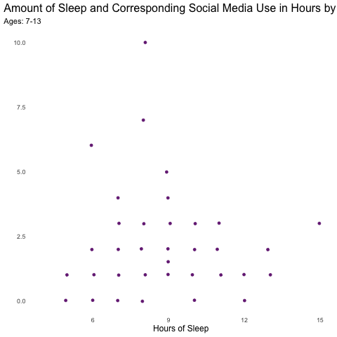

```{r setup, include=FALSE}
# knitr::opts_chunk$set(echo = TRUE, message = TRUE, warning = TRUE)
```


```{r libraries}
library(readr)
library(tidyverse)
library(lubridate)
library(maps)          
library(ggmap)
library(RColorBrewer)  # for color palettes
library(sf)            # for working with spatial data
library(leaflet)       # for highly customizable mapping
library(ggthemes)      # for more themes (including theme_map())
library(plotly)        # for the ggplotly() - basic interactivity
library(gganimate)     # for adding animation layers to ggplots
library(transformr)
library(ggimage)
library(ggtext)
library(patchwork)
library(gt)            # for creating nice tables
theme_set(theme_minimal())
```


```{r}

dataset <- read_csv("Data.csv") %>% 
  mutate(AgeCat = cut(Age, breaks = c(0,13,18,23,33,45,60), labels = c("0-13", "13-18", "18-23", "23-33", "33-45", "45-60"))) %>%
  mutate(avgsleep = mean(Sleep)) %>% 
  mutate(SocialCat = cut_number(SocialMedia, n = 3))
  
#labels = "0-1", "1-3", "3-10" label social media 

#View(dataset)

```

COVID-19 Implications on Mental Health in the U.S.

Within the United States, the rise of remote learning has called for additional attention on students’ mental health as they experience a lack of social interaction, less direct support from teachers, and difficulty focusing at home. Aside from academics, the mental well-being of all youth in general has also been negatively affected as children and their families are asked to self-quarantine and in some cases, leave their jobs. Health experts are now concerned about the mental health conditions for our youth in the long run. They believe that experiencing and living in these tough situations for an extended amount of time can cause children to have anxiety and depression which is why we need to start paying close attention to negative impacts of COVID-19 on mental health.  For more information regarding this issue, you may read the article provided in this [link](https://www.writingcity.com/how-remote-learning-affects-students-mental-health.html)

Implications in India

As Americans, we have seen and experienced the pandemic’s implications on mental health within the United States, but it leaves us quite curious about the present circumstances elsewhere. While searching for new research and data sets, we stumbled upon a relatively recent research done in Delhi, the capital territory of India. Data was also collected from subjects living in the National Capital Region (NCR) which encompasses both Delhi and its surrounding area. In this study, researchers looked at different age-groups of a total of 1,182 subjects, ages ranging from 7 to 59 years old, and how several aspects of their lives were affected after the lockdown. Additionally, they recorded the different coping mechanisms adopted due to such sudden changes. The various variables such as learning hours for online classes and self-study, duration of sleep, time spent on fitness and sleep were recorded and analysed as factors related to mental health. Although the effect on students’ education, social life, physical health, and mental well-being was expected, this research suggests that the public should take necessary measures to prevent psychological problems and improve students’ experiences in and outside of academics, for our current results are not meeting the expectations of the initial government policies. For specific details on the demographics, objectives, and methods of this study, please read the research paper linked [here] (https://www.researchgate.net/publication/347935769_COVID-19_and_its_impact_on_education_social_life_and_mental_health_of_students_A_Survey) 

Although the researchers in this study did a phenomenal job at creating, designing, and interpreting their own plots, we decided to ask different questions and explore our own interests by using the same data set while still acknowledging their remarkable findings. 


**Demographics:**

Before exploring the data set, it's important to first acknowledge that there is indeed a demographic imbalance. Of the 1,182 respondents, the research paper states that 84.3% of those subjects were 7 to 22 years of age with the mean age being 20.16 years old. This bar plot visually demonstrates that most of the data comes from school-age children and teenagers. This imbalance is understandable considering that the aim of this study was to research COVID-19 implications on the education, social life, and mental health of students. However, comparing different variables across multiple age-groups gets quite complicated and can be misleading if not carefully examined.  


```{r}
#demographics
ggplotly(dataset %>% 
  ggplot(aes(x = Age)) +
  geom_bar(fill = "steelblue1") +
  scale_x_continuous(name = "", breaks = c(5, 10, 15, 20, 25, 30, 35, 40, 45, 50, 55, 60)) +
  labs(title = "Number of Survey Respondents by Age", x = "Age", y = "") +
  theme(axis.line = element_blank(), 
        panel.grid = element_blank(), 
        plot.title.position= "plot", 
        strip.text.x = element_blank()))

dataset %>% 
  count(AgeCat) %>% 
  mutate(prop = n/sum(n)) %>% 
  gt(rowname_col = "AgeCat")%>% 
  tab_header("Respondents by Age Group") %>% 
  tab_stubhead(label="Age Group") %>%
  fmt_percent(columns = vars(prop), decimals = 3) %>% 
  cols_label(n = "Respondents", prop="Proportion") %>% 
  summary_rows(columns = vars(AgeCat, n),
    fns = list(
      total = ~sum(., na.rm = TRUE)),decimals = 0)
```

We noticed that most of the survey respondents were young, etc. From research paper: the total number of respondents was ___. 


Just as we observed with the previous plot, the number of respondents per region of residence also differs. This plot displays that there is indeed quite a significant difference between Delhi-NCR respondents and respondents living outside of the Delhi-NCR. Although the online-survey was originally aimed at institutions within the Delhi-NCR region, a significant number of responses from outside of Delhi-NCR was received, for distance-learning regulations forced many students to move out of homes and institutions to reside elsewhere. Of the total number of respondents, 38.3% were living outside of the Delhi-NCR.

```{r}
#demographics
dataset %>% 
  ggplot(aes(x = Region)) +
  geom_bar(fill = "steelblue1") +
  labs(title = "Number of Survey Respondents by Region", x = "", y = "") +
  theme(panel.grid = element_blank(), 
        plot.title.position= "plot", 
        strip.text.x = element_blank())
    
```

Observations about this plot. Describe NCR (National Capital Region), because Delhi is the Capital of India. The city is the center and the NCR is slightly larger than the urban area itself. 


```{r}
#not from test file
dataset %>% 
  ggplot(aes(x = Age, y = Sleep)) +
  geom_jitter() +
  # facet_wrap(vars(Age)) +
  labs(title = "Age and Sleep")
```

This plot compares the median number of hours spent in class by different age groups. For the sole purpose of this study, it is important to draw attention to how many hours students are spending sitting in front of a screen each day. From this plot, we can observe that respondents within the 0-13 and 13-18 age-groups spend the most time in class per day. The researchers emphasized that different variables (time spent on online class, self-study,fitness, sleep, and social media) changes with different age distributions. Average time spent in class and age-group was one of the relationships that were inversely proportional; As age-group value increases, the average number of hours spent online starts to decrease. 


```{r}
dataset %>%
  group_by(AgeCat, Connection, Region) %>% 
  ggplot(aes(x = AgeCat,
             y = OnlineClass)) +
  geom_boxplot(color = "steelblue", fill = "steelblue1", alpha = .5) +
  labs(x = "Age", 
       y = "", 
       title = "Comparing Hours Spent in Class Per Day by Age") +
  theme(axis.line = element_blank(), 
        panel.grid = element_blank(), 
        plot.title.position= "plot", 
        strip.text.x = element_blank())

```


```{r}

sleepmedia_anim <- dataset %>% 
  group_by(SocialMedia, avgsleep, AgeCat, Sleep) %>%
  summarise(avgmedia = mean(SocialMedia)) %>%
  ggplot(aes(x = Sleep, 
             y = SocialMedia, 
             color = AgeCat, 
             group = AgeCat)) +
  geom_jitter() +
  labs(y = "", 
       x = "Hours of Sleep", 
       title = "Amount of Sleep and Corresponding Social Media Use in Hours by Age Category", 
       subtitle = "Ages: {closest_state}") +
  transition_states(AgeCat)+
  theme(axis.line = element_blank(), 
        panel.grid = element_blank(), 
        plot.title.position= "plot", 
        legend.position = "none")+
  scale_color_viridis_d() +
  exit_fade() +
  enter_recolor(color = "aliceblue") +
  exit_recolor(color = "aliceblue")

animate(sleepmedia_anim, duration = 20)

anim_save("sleepmedia_anim.gif")
```

```{r}

```

```{r}
dataset %>%
  drop_na() %>% 
  mutate(`What respondents miss the most` = fct_lump_n(`What you miss the most`, 5)) %>%
  #filter(`What respondents miss the most` != "Other")  %>%
  count(`What respondents miss the most`, sort=TRUE) %>% 
  gt(rowname_col = "`What respondents miss the most`")%>% 
  tab_header("What Respondents Miss Most") %>% 
  cols_label(`What respondents miss the most`="",
             n = "")

ggplotly(dataset %>%
           drop_na() %>%
           mutate(`What respondents miss the most` = fct_lump_n(`What you miss the most`, 5)) %>% 
           ggplot()+
           geom_bar(aes(x=`What respondents miss the most`), fill="lightblue") +
           labs(x = "", 
                y = "", 
                title = "What Respondents Miss the Most") +
           theme(panel.grid = element_blank(), 
                 plot.title.position= "plot",
                 legend.position="none"))
```

```{r}
dataset %>% 
  drop_na() %>% 
  mutate(`What respondents miss the most` = fct_lump_n(`What you miss the most`, 5)) %>% 
  ggplot()+
  geom_bar(position="dodge", aes(x=AgeCat, fill=Region))+
  facet_wrap(vars(`What respondents miss the most`)) +
  labs(
    title = "What Respondents Miss Most by Age Group
    <span style='color:#F8766D;'>in Dehli</span>
    <span>and 
    <span style='color:#00BFC4;'>Outside Dehli</span>",
    x = "Age Group", y = "") +
  theme_minimal() +
  theme(plot.title = element_markdown(),
        legend.position = "none",
        axis.line = element_blank(), 
        panel.grid = element_blank(), 
        plot.title.position= "plot")
```

```{r}
#within AgeCat=0-13, what percentage said what:
ag1 <- dataset %>% 
  drop_na() %>% 
  mutate(`What respondents miss the most` = fct_lump_n(`What you miss the most`, 5)) %>% 
  filter(AgeCat=="0-13") %>%
  group_by(AgeCat,`What respondents miss the most`) %>% 
  count(sort=TRUE)  %>%
  mutate(prop=n/89*100) %>% 
  ggplot()+
  geom_col(position="dodge", aes(x=`What respondents miss the most`, y=prop), fill="dodgerblue") +
  labs(x = "", 
       y = "", 
       title = "Ages 0-13") +
  theme(legend.position = "none",
        axis.line = element_blank(), 
        panel.grid = element_blank(), 
        plot.title.position= "plot")

#within AgeCat=14-18, what percentage said what:
ag2 <- dataset %>% 
  drop_na() %>% 
  mutate(`What respondents miss the most` = fct_lump_n(`What you miss the most`, 5)) %>% 
  filter(AgeCat=="14-18") %>%
  group_by(AgeCat,`What respondents miss the most`) %>% 
  count(sort=TRUE)  %>%
  mutate(prop=n/265*100) %>% 
  ggplot()+
  geom_col(position="dodge", aes(x=`What respondents miss the most`, y=prop), fill="dodgerblue") +
  labs(x = "", 
       y = "", 
       title = "Ages 14-18") +
  theme(legend.position = "none",
        axis.line = element_blank(), 
        panel.grid = element_blank(), 
        plot.title.position= "plot")

#within AgeCat=19-23, what percentage said what:
ag3 <- dataset %>% 
  drop_na() %>% 
  mutate(`What respondents miss the most` = fct_lump_n(`What you miss the most`, 5)) %>% 
  filter(AgeCat=="19-23") %>%
  group_by(AgeCat,`What respondents miss the most`) %>% 
  count(sort=TRUE)  %>%
  mutate(prop=n/645*100) %>% 
  ggplot()+
  geom_col(position="dodge", aes(x=`What respondents miss the most`, y=prop), fill="dodgerblue") +
  labs(x = "", 
       y = "", 
       title = "Ages 19-23") +
  theme(legend.position = "none",
        axis.line = element_blank(), 
        panel.grid = element_blank(), 
        plot.title.position= "plot")

#within AgeCat=24-33, what percentage said what:
ag4 <- dataset %>% 
  drop_na() %>% 
  mutate(`What respondents miss the most` = fct_lump_n(`What you miss the most`, 5)) %>% 
  filter(AgeCat=="24-33") %>%
  group_by(AgeCat,`What respondents miss the most`) %>% 
  count(sort=TRUE)  %>%
  mutate(prop=n/84*100) %>% 
  ggplot()+
  geom_col(position="dodge", aes(x=`What respondents miss the most`, y=prop), fill="dodgerblue") +
  labs(x = "", 
       y = "", 
       title = "Ages 24-33") +
  theme(legend.position = "none",
        axis.line = element_blank(), 
        panel.grid = element_blank(), 
        plot.title.position= "plot")

#within AgeCat=34-45, what percentage said what:
ag5 <- dataset %>% 
  drop_na() %>% 
  mutate(`What respondents miss the most` = fct_lump_n(`What you miss the most`, 5)) %>% 
  filter(AgeCat=="34-45") %>%
  group_by(AgeCat,`What respondents miss the most`) %>% 
  count(sort=TRUE)  %>%
  mutate(prop=n/42*100) %>% 
  ggplot()+
  geom_col(position="dodge", aes(x=`What respondents miss the most`, y=prop), fill="dodgerblue") +
  labs(x = "", 
       y = "", 
       title = "Ages 34-45") +
  theme(legend.position = "none",
        axis.line = element_blank(), 
        panel.grid = element_blank(), 
        plot.title.position= "plot")

#within AgeCat=46-60, what percentage said what:
ag6 <- dataset %>% 
  drop_na() %>% 
  mutate(`What respondents miss the most` = fct_lump_n(`What you miss the most`, 5)) %>% 
  filter(AgeCat=="46-60") %>%
  group_by(AgeCat,`What respondents miss the most`) %>% 
  count(sort=TRUE)  %>%
  mutate(prop=n/4*100) %>% 
  ggplot()+
  geom_col(position="dodge", aes(x=`What respondents miss the most`, y=prop), fill="dodgerblue") +
  labs(x = "", 
       y = "", 
       title = "Ages 46-60") +
  theme(legend.position = "none",
        axis.line = element_blank(), 
        panel.grid = element_blank(), 
        plot.title.position= "plot")
```


```{r, fig.width=10, fig.height=11}
#pacth together graphs, have the mess around with the size when knitting to make it readable, we can also make it less categories if we want
(ag1|ag2) / (ag3|ag4) / (ag5 |ag6) +
  plot_annotation("What Respondents Miss the Most: Proportionally by Age Group")
```
